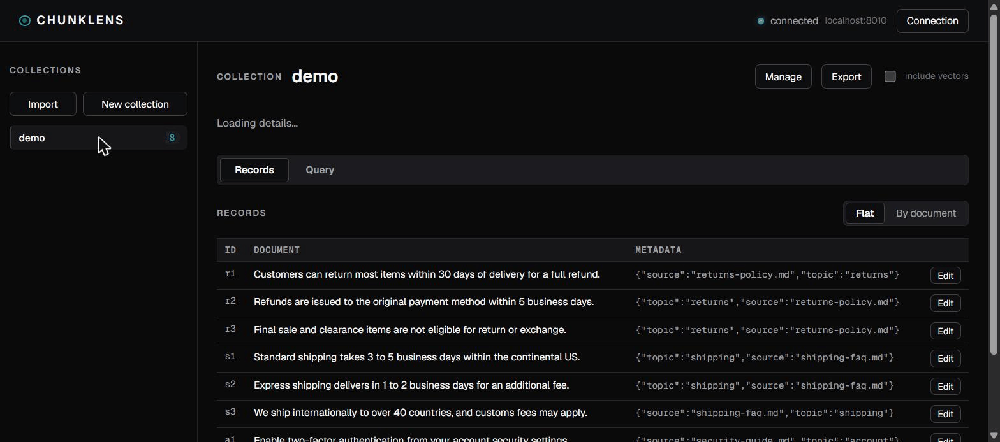

# ChunkLens

[](https://pypi.org/project/chunklens/)
[](https://pypi.org/project/chunklens/)
[](LICENSE)



A local-first inspector and retrieval debugger for ChromaDB.

> Status: `0.1.0`, published on PyPI. Early but functional. Install it with `pipx install chunklens` (see [Install](#install-packaged)) or run from source.

ChunkLens runs entirely on your machine. A small FastAPI backend wraps the official `chromadb` client and serves a React UI. It binds to `127.0.0.1` only and sends no telemetry. The one outbound request it can make is the one you ask for: embedding a query through a provider you choose. Any API key you enter stays in memory for the session and is never written to disk.

## Why

Working with a vector database usually means writing throwaway scripts to answer simple questions. What collections exist? What is actually stored in this one? Why did this query return these results? ChunkLens turns that into a UI. It is aimed at developers building RAG and other retrieval features who want to see and debug what their database is doing, not just run queries against it.

## Features

- Connect to any Chroma server and manage the connection (host, port, tenant, database, optional auth token) from the UI.
- Browse collections and page through their records: documents, embeddings, and metadata.
- Create, rename, and delete collections. Edit collection metadata and per-record metadata.
- Build `where` (metadata) and `where_document` (content) filters visually, with a live JSON preview, so you do not have to hand-write Chroma filter syntax.
- Run similarity queries by text or by pasting a raw vector. Results are scored, ranked, and show where each hit came from.
- Compare two queries side by side to see how their results differ.
- Query collections that use a non-default embedding function. ChunkLens detects the provider (OpenAI, Cohere, Voyage, Jina, Ollama, or sentence-transformers) and embeds your query text with it, using a key you provide for that session.
- Import and export a collection as a single portable JSON file.

## Install (packaged)

ChunkLens is on PyPI and installs as a single command, with the UI bundled in:

```bash
pipx install chunklens
```

Prefer uv? `uv tool install chunklens` does the same thing. Either way you get a `chunklens` command on your PATH.

Then run it:

```bash
chunklens
```

ChunkLens still needs a running Chroma server (see [Running it](#running-it)). Point it at one from the in-app Connection bar, or with `CHUNKLENS_CHROMA_HOST` / `CHUNKLENS_CHROMA_PORT`.

For local sentence-transformer embeddings, install the extra:

```bash
pipx install "chunklens[local-embedders]"
```

To build and install from source instead, for development or to try an unreleased change, build the wheel locally:

```bash
uv run --project backend python scripts/build_release.py   # builds the UI + wheel into backend/dist/
pipx install backend/dist/chunklens-0.1.0-py3-none-any.whl
```

## Requirements

- [uv](https://docs.astral.sh/uv/) for the Python side. It installs and manages the right Python for you, so you do not need a system Python.
  - macOS and Linux: `curl -LsSf https://astral.sh/uv/install.sh | sh`
  - Windows: `irm https://astral.sh/uv/install.ps1 | iex`
- Node 18 or newer for the frontend.

## Setup

```bash
# Backend: uv provisions Python, creates .venv, and installs deps from uv.lock
cd backend
uv sync
cd ..

# Frontend
cd frontend
npm install
cd ..
```

## Running it

ChunkLens needs a Chroma server running alongside it. Start Chroma first. All backend commands run from `backend/` through `uv run`.

### 1. Start a Chroma server

Keep this terminal open.

```bash
cd backend
uv run chroma run --path ../.chroma
```

### 2. (Optional) Seed demo data

A fresh Chroma is empty, so the UI shows no collections. Seed a small `demo` set. This downloads an embedding model on first run.

```bash
cd backend
uv run python ../scripts/seed_demo.py
```

### 3. Start ChunkLens

Pick one mode.

Production-like, where one process serves the UI and the API at a single URL:

```bash
cd frontend
npm run build        # build the UI into the backend (first run, and after any UI change)
cd ../backend
uv run chunklens
```

Then open http://127.0.0.1:8765.

Development, with a hot-reloading UI across two processes:

```bash
# Terminal A: backend API on :8765
cd backend
uv run chunklens

# Terminal B: Vite dev server, which proxies /api to the backend
cd frontend
npm run dev
```

Then open the URL Vite prints (for example http://localhost:5173), not :8765.

## Configuration

Every variable is optional.

| Variable | Default | Purpose |
|---|---|---|
| `CHUNKLENS_HOST` / `CHUNKLENS_PORT` | `127.0.0.1` / `8765` | Where ChunkLens serves |
| `CHUNKLENS_CHROMA_HOST` / `CHUNKLENS_CHROMA_PORT` | `localhost` / `8000` | The Chroma server to connect to |
| `CHUNKLENS_NO_BROWSER` | unset | Set to `1` to skip auto-opening a browser |

For querying collections that use a hosted embedding provider, you can also supply the key through Chroma's standard environment variables, for example `CHROMA_OPENAI_API_KEY`. Keys are read from the environment or entered per session in the UI. They are never stored on disk.

## Tests

```bash
# Backend
cd backend
uv run pytest

# Frontend unit tests
cd frontend
npm test

# End to end. Needs the UI built, a running Chroma seeded with scripts/seed_demo.py,
# and chunklens serving. Downloads an embedding model on first run.
cd frontend
npm run e2e
```

## Roadmap

- Saved queries and relevance checks, to track whether retrieval quality drifts over time.
- A visual view of the embedding space.
- A desktop build.

Support for other vector databases may come later. The current focus is making the ChromaDB experience genuinely good first.

## Privacy

ChunkLens is local-first by design. It binds to `127.0.0.1`, ships no telemetry, and uses no webfonts or external assets. The only outbound request it ever makes is one you start yourself: embedding a query through a provider you pick, with a key you supply. That key lives in memory for the session and is never written to disk.

One thing that is stored on disk: the optional Chroma connection token (not an embedding-provider key) is saved with the rest of the connection settings in `~/.chunklens/config.json`, so you do not have to re-enter it. On macOS and Linux that file is created with owner-only permissions (0600). Windows has no direct equivalent, so the file is only as protected as your user profile; if other people share the machine account, prefer leaving the token out and entering it per session.

## License

MIT. See [LICENSE](LICENSE).
